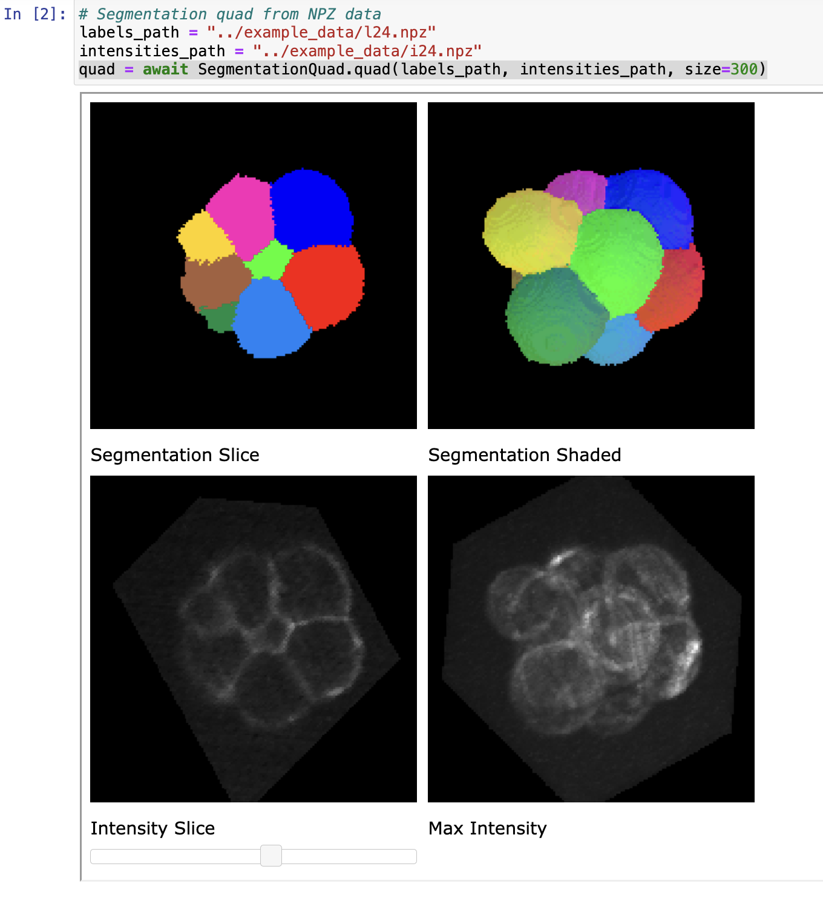

# volume_gizmos
Browser based interactive 3d data array visualizations



This project is currently an Alpha in development.

# Development (or experimental) install

To install an experimental version of volume_gizmos, first clone or download
the Github repository and then install in developer mode as follows:

```bash
 cd volume_gizmos
 pip install -e .
```

## Python API

Please see the Jupyter notebooks in the notebook folder for some examples
of how to launch these visualizations from within a Python notebook or script.

## Command lines

The package includes some command line interfaces for launching the visualizations.

### `volume_tryptich_gizmo`

The `volume_tryptich_gizmo` interface generates three views of a 3d volume array.
Open the link provided in a browser to view the interface.

```bash
$ cd example_data/
$ volume_triptych_gizmo -h
usage: volume_triptych_gizmo [-h] --volume VOLUME [--dI DI] [--dJ DJ] [--dK DK] [--size SIZE]

Display iso-surface, slice, and max-values for a 3d volume array.

optional arguments:
  -h, --help       show this help message and exit
  --volume VOLUME  File path to the volume
  --dI DI          voxel width
  --dJ DJ          voxel height
  --dK DK          voxel depth
  --size SIZE      canvas size

$ volume_triptych_gizmo --volume vis_male.npz --dI 1.5
File path: vis_male.npz
width (dI): 1.5
height (dJ): 1.0
depth (dK): 1.0
canvas size: 512
Loading volume 'vis_male.npz'
loaded (256, 256, 128) uint8

Open gizmo using link (control-click / open link)

<a href="http://127.0.0.1:49555/gizmo/http/MGR_1715261766857_2/index.html" target="_blank">Click to open</a> <br> 
 GIZMO_LINK: http://127.0.0.1:49555/gizmo/http/MGR_1715261766857_2/index.html 
```
### `segmentation_quad_gizmo`

The `segmentation_quad_gizmo` compares an intensity volume to a segmentation volume.

```bash
(base) HP07M20G6J:example_data awatters$ segmentation_quad_gizmo -h
usage: segmentation_quad_gizmo [-h] --seg SEG --int INT [--size SIZE]

Display source volume and segmentation.

optional arguments:
  -h, --help   show this help message and exit
  --seg SEG    File path to the segmentation
  --int INT    File path to the intensities
  --size SIZE  canvas size
(base) HP07M20G6J:example_data awatters$ segmentation_quad_gizmo --seg l24.npz --int i24.npz 
int path: i24.npz
seg path: l24.npz
size: 512
loading intensity volume
loading segmentation volume
loaded volumes (97, 110, 103) (97, 110, 103) float64 uint16

Open gizmo using link (control-click / open link)

<a href="http://127.0.0.1:50820/gizmo/http/MGR_1715262075857_2/index.html" target="_blank">Click to open</a> <br> 
 GIZMO_LINK: http://127.0.0.1:50820/gizmo/http/MGR_1715262075857_2/index.html 
```

# Note on WebGPU security restrictions

Some of the components of this package use WebGPU in the browser
interface.  As noted here

<a href="https://developer.mozilla.org/en-US/docs/Web/API/WebGPU_API">
https://developer.mozilla.org/en-US/docs/Web/API/WebGPU_API
</a>

WebGPU is only available in "secure contexts".  This means that these
components will work if the Python "parent" and the browser "child"
both run on the same computer, but they probably will not work when the
Python parent runs on a different computer from the browser "child" because
the parent and child communicate using HTTP which is insecure.

## Update javascript dependencies

NPM is used to manage Javascript packages and dependencies.
The Javascript is frozen in the Python package.
To load the latest Javascript, use the following command:

```bash
rm -rf package-lock.json node_modules volume_gizmos/node_modules
npm install
#cp -r node_modules volume_gizmos/ -- automatic
```

Then commit the updates to the git repository.
